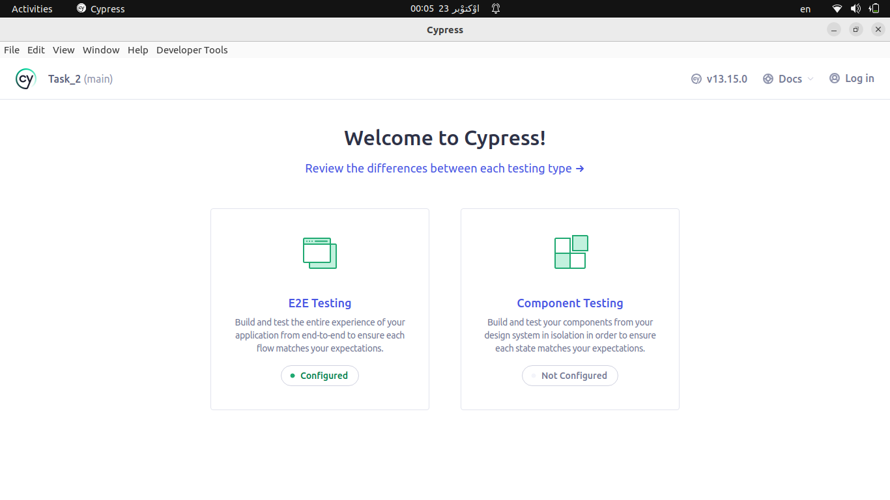
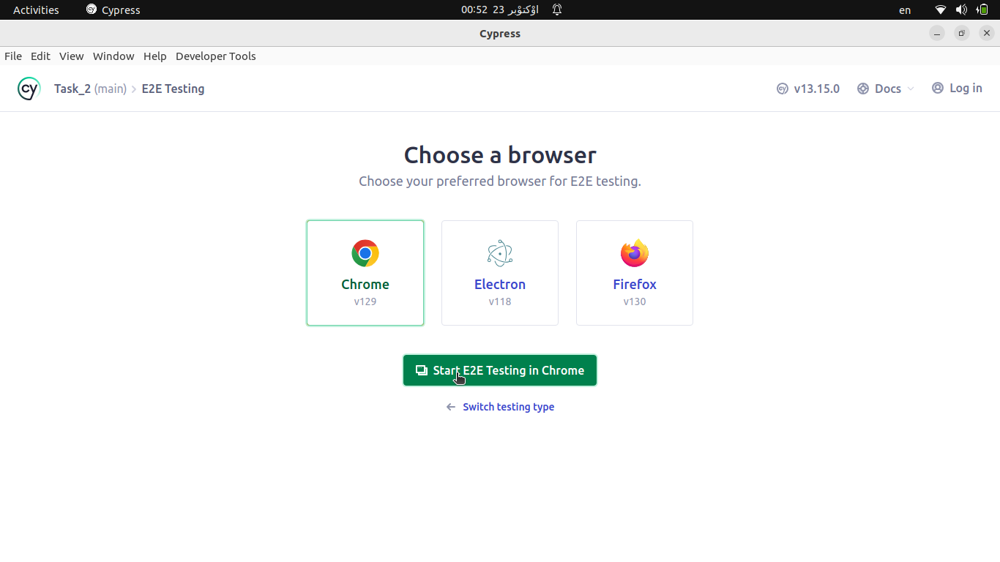
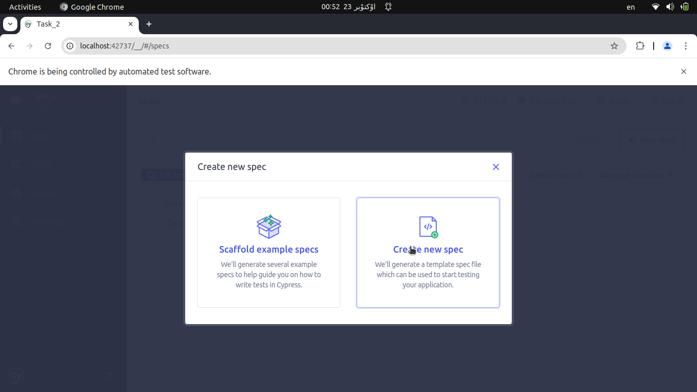
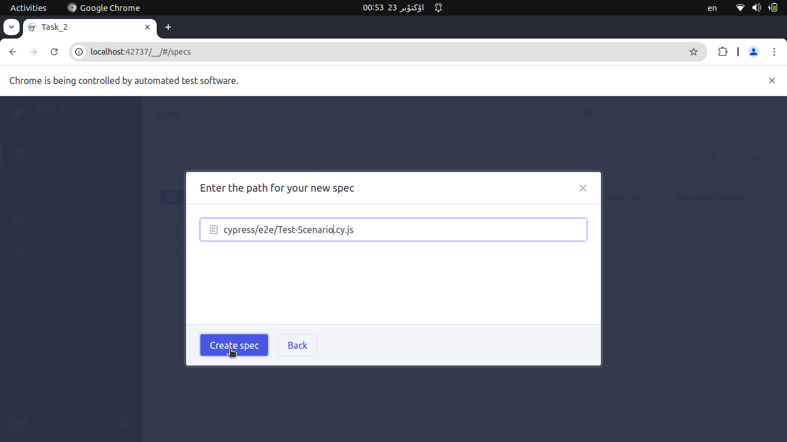
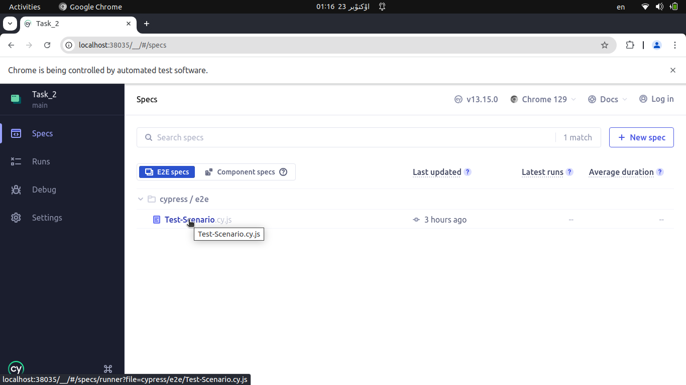
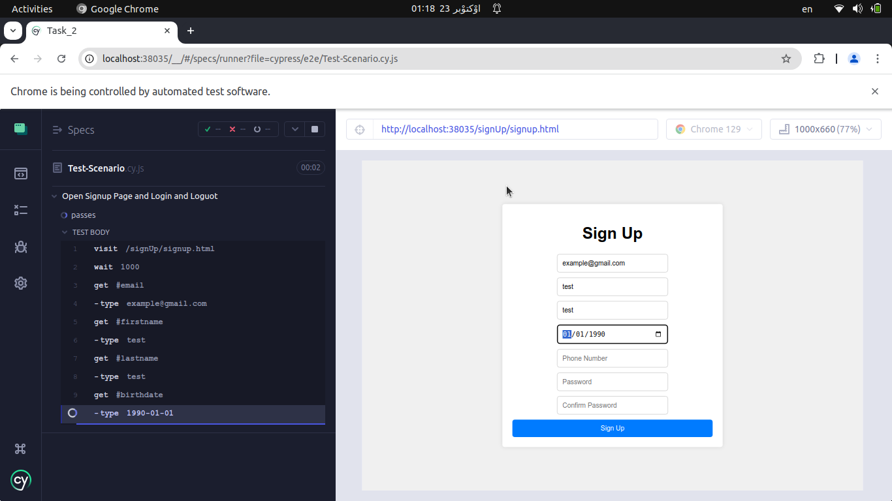

## About The Project

Cypress Simple Project . 


## Getting Started

Make sure you have Node.js installed and that you have already run npm init or have a node_modules folder or package.json file in the root of your project to ensure Cypress is installed in the correct directory.
Node.js 18.x, 20.x, 22.x and above.

### Prerequisites
1. Install VScode [https://code.visualstudio.com](https://code.visualstudio.com/)

2. Make sure you have Node.js installed and that you have already run npm init or have a node_modules folder or package.json file in the root of your project to ensure Cypress is installed in the correct directory.
Node.js 18.x, 20.x, 22.x and above. 


### Installation

1. Make Automatade-Test Directory:
   ```bash
   mkdir Automatade-Test
   ```
    
   ```bash
   cd /Automatade-Test
   ```
 open Directory with vscode:
   ```bash
   code .
   ```
   
2. in vscode terminal run this command:
   ```bash
   npm init -y
   ```
3. Install Cypress with npm packet manager:
   ```bash
   npm install cypress --save-dev
   ```
4. Verify Cypress:

   ```bash
   npx cypress verify
   ```
5. open Cypress :

   ```bash
   npx cypress open
   ```
   
6. in Cypress app select E2E testing:


7. and make Configure file:


8. select Browsre for test:



9. create new spec file :


make Test-Scenario.cy.js:


10. in vscode open Test-Senario.cy.js write Tests and Save the file:

   ```
   describe('Open Signup Page and Login and Loguot', () => {  
  it('passes', () => {  

    cy.visit('/signUp/signup.html')
    cy.wait(1000)
    ////////////////////////////////////////////////////////////////////////////////

    // SignUp New User
    cy.get('#email').type('example@gmail.com')
    cy.get('#firstname').type('test')
    cy.get('#lastname').type('test')
    cy.get('#birthdate').type('1990-01-01')
    cy.get('#phone').type('09129649133')
    cy.get('#password').type('test1')
    cy.get('#password-confirm').type('test1')
    cy.get('form').contains('Sign Up').click()
    cy.url().should('include', 'login')
    cy.wait(1000)
    /////////////////////////////////////////////////////////////////////////////////

    // Redirect to Login Page and Enter Email and Password
    cy.get('#login-email').type('example@gmail.com')
    cy.get('#login-password').type('test1')  
    cy.get('form').contains('Log In').click()
    cy.wait(1000)
    /////////////////////////////////////////////////////////////////////////////////

    // Verify successful login and redirect to dashboard
    cy.url().should('include', '/dashboard/dashboard.html')  
    cy.contains('Hello test!')
    cy.contains('Welcome to Your ')
    cy.contains('Sign Out')

    cy.wait(1000)
    cy.get('#sign-out-button').click() // Signout
    cy.url().should('include', '/login')

    })
})
  
   ```
      
11. in Cypress Click on Test-Scenario.cy.js:


and Tests Starting 


