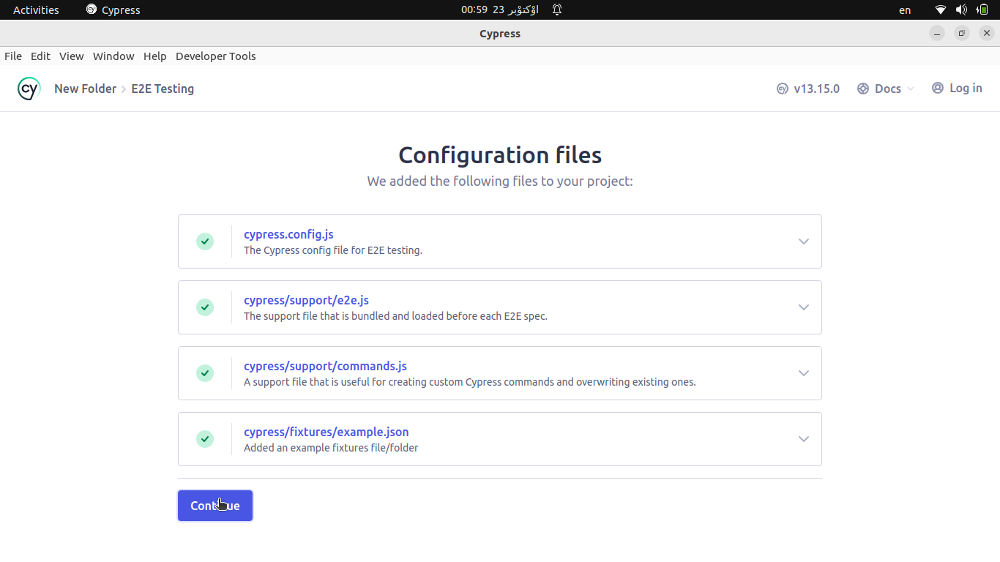

## About The Project

Cypress Simple Project . 

[![Product Name Screen Shot][product-screenshot]](https://cypress.io)


### Built With

* [![nodejs][nodelj.org]][nodjs-url]
* [![cypress][cypress.io]][cypress-url]


## Getting Started

Make sure you have Node.js installed and that you have already run npm init or have a node_modules folder or package.json file in the root of your project to ensure Cypress is installed in the correct directory.
Node.js 18.x, 20.x, 22.x and above.

### Prerequisites
1. Install VScode [https://code.visualstudio.com](https://code.visualstudio.com/)

2. Make sure you have Node.js installed and that you have already run npm init or have a node_modules folder or package.json file in the root of your project to ensure Cypress is installed in the correct directory.
Node.js 18.x, 20.x, 22.x and above. 


### Installation

1. Make Automatade-Test Directory:
   ```bash
   mkdir Automatade-Test
   ```
    
   ```bash
   cd /Automatade-Test
   ```
 open Directory with vscode:
   ```bash
   code .
   ```
   
2. in vscode terminal run this command:
   ```bash
   npm init -y
   ```
3. Install Cypress with npm packet manager:
   ```bash
   npm install cypress --save-dev
   ```
4. Verify Cypress:

   ```bash
   npx cypress verify
   ```
5. open Cypress :

   ```bash
   npx cypress open
   ```
   
6. in Cypress app select E2E testing:


7. and make Configure file:


8. select Browsre for test:


   

